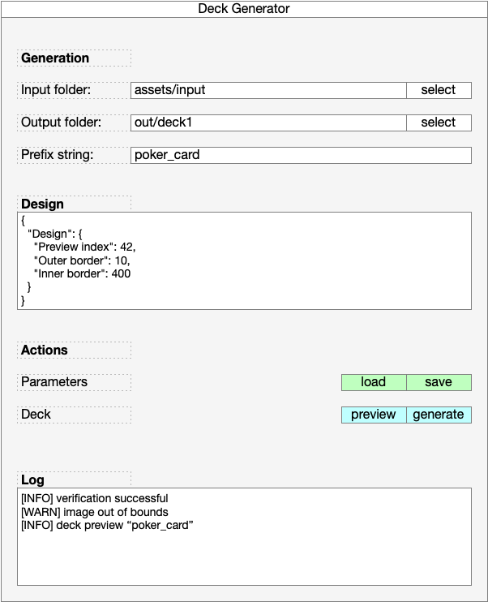

# DeckGen

Python application to generate a deck of cards. 
I start from 
- The command line application [imedit-prototype.py](../imedit-prototype.py)
- The GUI for the application [deckgen-prototype.py](../deckgen-prototype.py)

todo
- print the current parameters for the gui
- match the parameters in the CLI app
- merge the two 

## Requirements Application

MVC python app, with Model = DeckGenData, View = DeckGenGui, Controller = DeckGenController
The code should be clean, minimal, and avoid duplications where possible

### Model 

The model is a dataclass with the fields and default values visible in this snippet
```
input_folder="assets/input",    
output_folder="out/deck1", 
prefix_string="poker_deck",
model_params = {
  "Design": {
    "Preview index": 42,
    "Outer border": 10,
    "Inner border": 400
  }
}
```
the model has a method get_save_file, returning "$output_folder/$prefix_string.json"

The model is responsible for load and save: 
* load: from get_save_file() 
* save: the fields into a pretty-printed file:  get_save_file()

### View

The GUI is represented in the attached image. 


* The GUI is initialised with the data model
* The input_folder, output_folder, prefix_string, and design_text widgets are bound to the corresponding model fields. 
* select buttons for input and output folders: open a folder selection dialog initialized with the current value of the corresponding text input. Upon selection, the corresponding text value is updated.
* load and save buttons trigger load and save methods on the controller
* preview and generate buttons trigger preview and generate methods on the controller.
* The Log text area displays messages sent from the logger (another class initialized by the Controller)

### Controller

The Controller initializes Model and View, and provides several methods:
- log(message_line): writes a message both to console and into the log_text area of the gui
- load(path): if the get_save_file() path exists invoke model load, and trigger a GUI update
- save(path): id the get_save_file() path exists, ask to overwrite. If yes, the model is saved to file.
- preview: open a new window with a placeholder for an image to generate and log "[info] preview generated"
- generate: log "[info] generated deck $model.prefix_string into $model.output_folder

The controller should also have a log function to perform log both on console and on the log text field of the GUI


 ---

### Requirements Script (initial impl)

A python program that given the input, generates images of size 2496 x 1872 representing the cards of a deck of poker cards. 

The program takes as input 
- input_folder containing a set of files
- output_folder that will contain the output
- prefix_string: to prepend to the filenames of the cards
- n_card_gen: a number < 52 to tell how many card to generate

The program output will be
- 52 files generated into the output folder
- message logging to report the status on console

The program does the following: 
- check the input folder contains a set of mandatory files:
    - im-back*.png : back of the poker card, with aspect ration 2:3, and size 1248 x 1872 
    - im-front*.png : background for the front of the poker card, with aspect ration 2:3, and size 1248 x 1872
    - suit-heart*.png : aspect ration 1:1
    - suit-diamond*.png : aspect ration 1:1
    - suit-club*.png : aspect ration 1:1
    - suit-spades*.png : aspect ration 1:1
    - *.ttf : at least one font file
- if any of the mandatory files is not present, the program sends an error message "Missing input files: <list-of-missing-files>, and terminates
- for each of the mandatory png input files, the program loads one image
    - e.g. for "im-back*.png" if there are "im-back-00.png" and "im-back-01.png" the program loads the latter, as it is the last in alphabetical order
- for the *.ttf files, the program prints all the names of the Fonts, and takes the last one in alphabetic order.
- the image processing starts and goes as follows:
    - take the two images -back and -front, resize both to size 1248 x 1872 (if not already that size)
    - take the four image suit-[heart|diamond|club|spades], resize to size 500x500
    - for 1 to n_card_gen (max 52), loop over card card suits (heart, diamond, club, spaces) abd values (2,3, … , 10,J,Q,K,A). Foreach pair (value, suit) do this:
        - build a canvas of size 1248 x 1872, and put image-front in it
        - in the top-left and bottom-right corner of the canvas put the card value (2,3, … , 10,J,Q,K,A) stacked on top of the suit, with the correct color (red for heart and diamond, black otherwise), and the specified font  and font size. Note the card should be symmetric (top-down), so the value/suit on the bottom right should be rotated 180 degrees (top-down) 
        - in the center of the canvas, put the image for the suit (heart, diamond, club, spades). Such image should be centered and scaled to have a width of 500 pts
        - when done, expand the canvas to 2496 x 1872, and 
        - keep the current canvas as left half, representing the card front
        - on the right half of the expanded canvas, put the image-back, representing the back of the card
        - save the image as "$(prefix_string)_$(current_index)_$(card_suit)_$(card_val).png"


----
see this: https://www.mattgyver.com/tutorials/2022/3/14/playing-card-deck-design-tips


We start from providing the program two folders: 
- an input folder containing a set of files
- an output folder that will contain the output

Below you see the files that the input folder contains
mandatory files
- im-back*.png 
- im-front*.png
- suit-heart*.png
- suit-diamond*.png
- suit-club*.png
- suit-spades*.png
- at least one *.ttf files providing fonts
optional files
- face-jack*.pdf
- face-queen*.pdf
- face-king*.pdf

The program should do the following
- check the input folder exists, and that the mandatory files are present
- check the output folder exists


We start from two images of size ‪1248 x 1872‬ * one image represent the back of the deck * the other image represents the bg of the card front. The program takes as input * Font Type (and size) to generate the numbers on the cards * four images of the symbols (heart diamond spade club) * three images for Jack Queen King
The program should generate 52 images of size 2496 x 1872‬, where the left half of the card represents the card front, and the right part of the card represents the back.

inputs
* image-back (aspect ratio 2:3)
* image-front (aspect ratio 2:3)
* image-heart (aspect ratio 1:1)
* image-diamond (aspect ratio 1:1)
* image-club (aspect ratio 1:1)
* image-spades (aspect ratio 1:1)
* image-jack
* image-queen
* image-king
* font-file ttf, font size

processing
* take the two images -back and front, resize both to size ‪1248 x 1872‬
* for each of the 52 cards loop over card value (2,3, … , 10,J,Q,K,A) and suits (heart, diamond, club, spaces) and:
   * build a canvas of size 1248 x 1872‬, and put image-front in it
   * in the top-left and bottom-right corner of the canvas put the card value (2,3, … , 10,J,Q,K,A) stacked on top of the suit, with the correct color (red for heart and diamond, black otherwise), and the specified font  and font size. Note the card should be symmetric, so the value/suit on the bottom right should be rotated 180 degrees (top-down)
   * in the center of the canvas, put the image for the suit (heart, diamond, club, spades). Such image should be centered and scaled to have a width of 500 pts
   * when done, expand the canvas to 2496X1872, and 
      * keep the current canvas a left half, representing the card front
      * on the right half of the expanded canvas, put the image-back, representing the back of the card
* for the moment don’t consider the other images jack, queen, king, but add the fields that shuold store the path to such images.